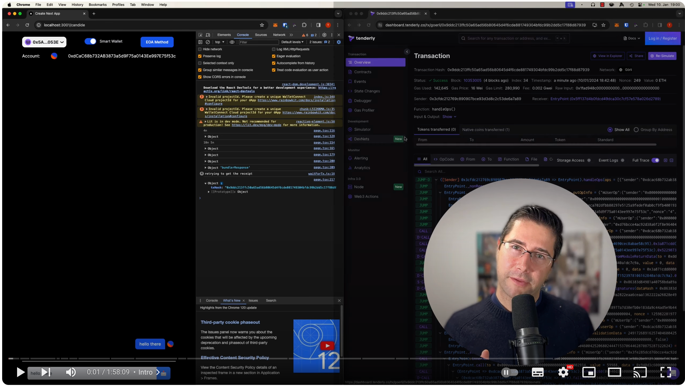

# ERC4337 Application Demo

This repository serves as a [living demonstration](https://erc4337-candide.vercel.app/) of the ERC4337 standard for account abstraction in Ethereum. Account abstraction is a paradigm shift in user account management, offering enhanced user experiences by abstracting away the complexities typically associated with Ethereum accounts.

This is the Demo-Repository for the [Video Walkthrough](https://www.youtube.com/watch?v=v_V4Wqcn7vE):

[](https://www.youtube.com/watch?v=v_V4Wqcn7vE)


## Account Abstraction Benefits

 - Simplified User Experience: Account abstraction enables a more intuitive user experience, removing the friction associated with managing private keys and gas fees.
 - Enhanced Security: By decoupling the execution of transactions from the requirement for ETH and private keys, account abstraction allows for more secure and flexible user account protection measures.
 - Innovation in UX/UI: Designers and developers are empowered to create novel user interfaces and user experiences, smoothing out the onboarding process for new users and improving the interaction with dApps.

## Impact on Blockchain Usability

The implementation of account abstraction can have a substantial impact on the mainstream appeal and usability of blockchain technology. It paves the way for Ethereum to be accessible to a broader audience by aligning user experiences closer to traditional web2 services while preserving the decentralized ethos of blockchain.

## Repository Contents

### /chatter-app
A fully-featured Next.js application utilizing RainbowKit, showcasing the integration with StackUp, Candide, and Alchemy for account abstraction. This subproject focuses on demonstrating how on-chain wallets, such as those provided by StackUp and Alchemy, can be managed in a simplified chat application context. Additionally, Candide's implementation leverages the Safe wallet as a representation of how account abstraction can function within user-friendly applications. [Demo here](https://erc4337-chatter-nextjs-app.vercel.app/) [Repo here](https://github.com/tomw1808/erc4337-chatter-nextjs-app/)

### /erc4337-candide
A trim-down Next.js application that presents an updated ERC4337 example utilizing the Candide framework with SafeL2 version 1.4.1. This submodule makes dedicated use of the updated Candide framework. [Demo here](https://erc4337-candide.vercel.app/) [Repo here](https://github.com/tomw1808/erc4337-candide)

### /smart-contracts
The smart contracts that underpin the demo applications are composed in Solidity (version 0.8.20) and utilize the Foundry framework for robust development, testing, and deployment. It contains the Chat-Contract, as well as a simple Paymaster that basically pays for everything. [Repo here](https://github.com/tomw1808/erc4337-chatter-contracts)

## Configuration & Setup

## Codesandbox
There is a [fully featured Codesandbox Devbox](https://codesandbox.io/p/devbox/erc4337-chatter-8fc2sh?embed=1&file=%2Ferc4337-chatter-application%2Fchatter-app%2Fapp%2Fpage.tsx&layout=%257B%2522sidebarPanel%2522%253A%2522EXPLORER%2522%252C%2522rootPanelGroup%2522%253A%257B%2522direction%2522%253A%2522horizontal%2522%252C%2522contentType%2522%253A%2522UNKNOWN%2522%252C%2522type%2522%253A%2522PANEL_GROUP%2522%252C%2522id%2522%253A%2522ROOT_LAYOUT%2522%252C%2522panels%2522%253A%255B%257B%2522type%2522%253A%2522PANEL_GROUP%2522%252C%2522contentType%2522%253A%2522UNKNOWN%2522%252C%2522direction%2522%253A%2522vertical%2522%252C%2522id%2522%253A%2522clrlyar6g00063b6ku7nvgs1f%2522%252C%2522sizes%2522%253A%255B70%252C30%255D%252C%2522panels%2522%253A%255B%257B%2522type%2522%253A%2522PANEL_GROUP%2522%252C%2522contentType%2522%253A%2522EDITOR%2522%252C%2522direction%2522%253A%2522horizontal%2522%252C%2522id%2522%253A%2522EDITOR%2522%252C%2522panels%2522%253A%255B%257B%2522type%2522%253A%2522PANEL%2522%252C%2522contentType%2522%253A%2522EDITOR%2522%252C%2522id%2522%253A%2522clrlyar6g00023b6k904d2ya4%2522%257D%255D%257D%252C%257B%2522type%2522%253A%2522PANEL_GROUP%2522%252C%2522contentType%2522%253A%2522SHELLS%2522%252C%2522direction%2522%253A%2522horizontal%2522%252C%2522id%2522%253A%2522SHELLS%2522%252C%2522panels%2522%253A%255B%257B%2522type%2522%253A%2522PANEL%2522%252C%2522contentType%2522%253A%2522SHELLS%2522%252C%2522id%2522%253A%2522clrlyar6g00043b6k92ungqpz%2522%257D%255D%252C%2522sizes%2522%253A%255B100%255D%257D%255D%257D%252C%257B%2522type%2522%253A%2522PANEL_GROUP%2522%252C%2522contentType%2522%253A%2522DEVTOOLS%2522%252C%2522direction%2522%253A%2522vertical%2522%252C%2522id%2522%253A%2522DEVTOOLS%2522%252C%2522panels%2522%253A%255B%257B%2522type%2522%253A%2522PANEL%2522%252C%2522contentType%2522%253A%2522DEVTOOLS%2522%252C%2522id%2522%253A%2522clrlyar6g00053b6kt3jxl9m9%2522%257D%255D%252C%2522sizes%2522%253A%255B100%255D%257D%255D%252C%2522sizes%2522%253A%255B50%252C50%255D%257D%252C%2522tabbedPanels%2522%253A%257B%2522clrlyar6g00023b6k904d2ya4%2522%253A%257B%2522id%2522%253A%2522clrlyar6g00023b6k904d2ya4%2522%252C%2522tabs%2522%253A%255B%255D%257D%252C%2522clrlyar6g00053b6kt3jxl9m9%2522%253A%257B%2522id%2522%253A%2522clrlyar6g00053b6kt3jxl9m9%2522%252C%2522activeTabId%2522%253A%2522clrlzg66g01423b6k39wefje3%2522%252C%2522tabs%2522%253A%255B%257B%2522type%2522%253A%2522TASK_PORT%2522%252C%2522taskId%2522%253A%2522start%2520chat%2520app%2522%252C%2522port%2522%253A3000%252C%2522id%2522%253A%2522clrlzg66g01423b6k39wefje3%2522%252C%2522mode%2522%253A%2522permanent%2522%252C%2522path%2522%253A%2522%252Fstackup%2522%257D%255D%257D%252C%2522clrlyar6g00043b6k92ungqpz%2522%253A%257B%2522id%2522%253A%2522clrlyar6g00043b6k92ungqpz%2522%252C%2522activeTabId%2522%253A%2522clrlzg31x012g3b6kjrgbvzeb%2522%252C%2522tabs%2522%253A%255B%257B%2522id%2522%253A%2522clrlyar6g00033b6k39z2q9gr%2522%252C%2522mode%2522%253A%2522permanent%2522%252C%2522type%2522%253A%2522TASK_LOG%2522%252C%2522taskId%2522%253A%2522start%2522%257D%252C%257B%2522type%2522%253A%2522TASK_LOG%2522%252C%2522taskId%2522%253A%2522start%2520chat%2520app%2522%252C%2522id%2522%253A%2522clrlzg31x012g3b6kjrgbvzeb%2522%252C%2522mode%2522%253A%2522permanent%2522%257D%255D%257D%257D%252C%2522showDevtools%2522%253Atrue%252C%2522showShells%2522%253Atrue%252C%2522showSidebar%2522%253Atrue%252C%2522sidebarPanelSize%2522%253A15%257D) setup, in case you want to directly dive in.

## Cloning The Repository

First clone the repository including its submodules: 

```
git clone --recurse-submodules https://github.com/tomw1808/erc4337-chatter-application.git
```

### Contracts

Written in Solidity with Foundry. To get them to build, install [Foundry](https://book.getfoundry.sh/getting-started/installation).

Then you can build the contracts:

```
cd chatter-contracts
forge build
```

## Chatter ERC4337 Application

> :warning: **Version Updates**: There are new versions from Viem and Wagmi, which rainbowkit do not support as of writing these lines. Be careful that the installation might differ in the near future when rainbowkit supports viem and wagmi versions 2.x.


The application written in NextJS:

```
cd chatter-app
npm install
npm run dev
```

Have a Browser-Wallet like MetaMask ready then open [http://localhost:3000](http://localhost:3000) with your browser to see the result.

## ERC4337-Candide Example

As I mention a few times in the video, the candide team was working hard to bring a new version with the new audited safe-wallet out. This happened and I tried to make a demo for that specifically, since a lot of the syntax changed. I still think its worth to go that route, because with safe you just get a nice UI on top of the smart contracts at https://app.safe.global/

To get it to run:


```
cd erc4337-candide
npm i
npm run dev
```

**Note:** If it runs slow with the chat-messages, try adding an Infura-ID to `.env`. If there is no infura id, it will automatically use a public provider which might be slow.

Open [http://localhost:3000](http://localhost:3000) with your browser to see the result.

## Learn More

To learn more about ERC4337 Account Abstraction, take a look at the following resources:

- [Candide Documentation](https://docs.candide.dev/wallet/abstractionkit/introduction/) - The library I used here
- [Eth Infinitism Repo](https://github.com/eth-infinitism/account-abstraction/tree/develop) - The core team around erc4337 developing the entrypoint
- [Abstractionkit Github Repo](https://github.com/candidelabs/abstractionkit/tree/main) - The official repo for Candide Abstractionkit
- [Stackup/Alchemy/Candide Video Walkthrough](https://youtu.be/v_V4Wqcn7vE) - My lengthy end-2-end video walkthrough of the Stackup/Candide/Alchemy Walkthrough
- [ERC4337 App using Candide](https://erc4337-candide.vercel.app/)
- [Chatter ERC4337 App using Stackup/Alchemy/Candide](https://erc4337-chatter-nextjs-app.vercel.app/)
- [Ethereum-Blockchain-Developer](https://ethereum-blockchain-developer.com) - Learn Solidity and Ethereum Development from me 🤗

## Get In Touch

 - [Me](https://thomaswiesner.com)
 - [My Github](https://github.com/tomw1808)
 - [Find me on LinkedIn](https://www.linkedin.com/in/thomas-wiesner)
 - [Find me on Discord](https://discord.gg/nKV7xzxdEh)